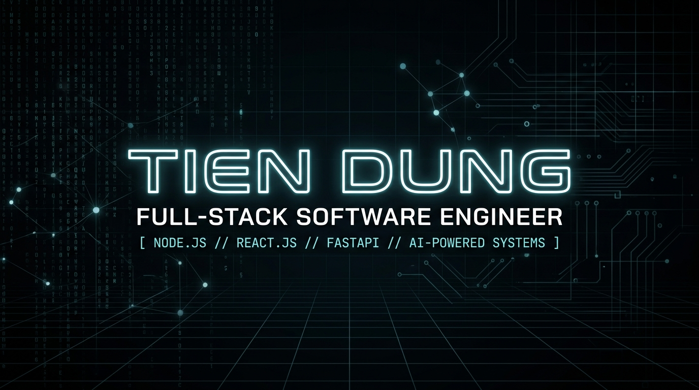

<p align="center">
  
</p>

<p align="center">
  <a href="https://github.com/tiendung-dev">
    
  </a>
</p>

<p align="center">
  <a href="mailto:tien.dungg2011@gmail.com"></a>
  <a href="https://github.com/tiendung-dev"></a>
  <a href="tel:0978168101"></a>
  
</p>

---

### ⚡ `whoami`

```bash
tiendung@dev-station:~$ whoami --verbose
┌────────────────────────────────────────────────────────────────────────┐
│  Name        : Nguyen Tien Dung (Tiến Dũng)                            │
│  Role        : Full-Stack Developer / Software Engineer               │
│  Education   : Software Engineering @ FPT University (Final Year)      │
│  Specialty   : Major in Node.js | Microservices | AI Integration       │
│  Location    : Me So, Hung Yen, Vietnam                                │
│  Philosophy  : "Resilient Backend, Reactive UI, Scalable Systems."     │
└────────────────────────────────────────────────────────────────────────┘
```

<div align="center">
  
</div>

> 🎯 **Mục tiêu nghề nghiệp:**  
> Tập trung xây dựng các ứng dụng web Full-Stack hiệu năng cao từ Frontend đến Backend, tối ưu hóa kiến trúc API, quản trị cơ sở dữ liệu và tích hợp các công cụ **AI-Assisted** (Gemini, Groq Llama 3) vào quy trình thực tế nhằm nâng cao năng suất và giá trị sản phẩm.

---

### 🛠️ Tech Stack & Arsenal

<div align="center">

#### 🌐 Frontend Development
<p>
  
  
  
  
  
  
</p>

#### ⚙️ Backend & API Architecture
<p>
  
  
  
  
  
  
  
  
</p>

#### 🗄️ Databases & Caching
<p>
  
  
  
  
</p>

#### 🚀 DevOps, Cloud & AI Tools
<p>
  
  
  
  
  
  
  
  
</p>

</div>

---

### 🚀 Flagship Engineering Projects

| Project | Role & Description | Tech Stack | Repositories & Live Demo |
| :--- | :--- | :--- | :---: |
| 💼 **VietWorks**<br>*(Online Recruitment & Smart ATS Platform)* | **Backend Developer**<br>• Nền tảng tuyển dụng thông minh tích hợp hệ thống ATS phân luồng ứng viên.<br>• Tích hợp AI Resume Matching tự động khớp hồ sơ ứng viên.<br>• Bộ công cụ tạo CV trực tuyến & xuất file PDF A4 chuẩn chuyên nghiệp. | `Node.js` `Express.js` `FastAPI` `Gemini API` `Groq (Llama 3)` `MongoDB` `Docker` `Redis` | [AI Module](https://github.com/tiendung-dev/AI-VietWorks) • [Backend](https://github.com/tiendung-dev/Backend-VietWorks) • [API Service](https://github.com/tiendung-dev/API-VietWorks) |
| 💆 **LumiX**<br>*(Spa & Salon Booking Management System)* | **Fullstack Developer**<br>• Hệ thống đặt lịch trực tuyến toàn diện cho khách hàng.<br>• Bảng điều khiển quản lý lịch hẹn, nhân sự, dịch vụ và báo cáo tài chính.<br>• Tích hợp thông báo real-time qua WebSockets & cổng thanh toán PayOS. | `React.js` `Vite` `Tailwind CSS` `Node.js` `Express.js` `MongoDB` `WebSockets` `PayOS` `Redis` | [Source Code](https://github.com/tiendung-dev/SpaBookingSystem) • [🌐 Live Demo](https://spa-booking-system-ochre.vercel.app) |

---

### 🔄 Auto-Updated Repositories & Projects

<!-- RECENT_PROJECTS_START -->

| Repository | Description | Primary Stack | Stars | Last Pushed |
| :--- | :--- | :---: | :---: | :---: |
| **[SpaBookingSystem](https://github.com/tiendung-dev/SpaBookingSystem)** | 💆 End-to-end Spa & Salon Booking platform with real-time notifications & PayOS integration |  | ⭐ 0 | `2026-08-24` |
| **[Backend-VietWorks](https://github.com/tiendung-dev/Backend-VietWorks)** | 🛠️ Scalable backend architecture & database connectors for VietWorks ATS | `Code` | ⭐ 0 | `2026-08-22` |
| **[AI-VietWorks](https://github.com/tiendung-dev/AI-VietWorks)** | 🤖 AI microservice powering intelligent resume matching & ATS scoring using Gemini & Llama 3 |  | ⭐ 0 | `2026-08-22` |
| **[API-VietWorks](https://github.com/tiendung-dev/API-VietWorks)** | ⚡ Core RESTful API service for VietWorks recruitment portal & candidate pipeline |  | ⭐ 0 | `2026-08-20` |
| **[Workly_App](https://github.com/tiendung-dev/Workly_App)** | 📱 Productivity and workflow management mobile application |  | ⭐ 0 | `2026-07-28` |
| **[PRM393](https://github.com/tiendung-dev/PRM393)** | 📱 Mobile application project built with modern cross-platform practices |  | ⭐ 0 | `2026-07-13` |

<!-- RECENT_PROJECTS_END -->

<p align="right">
  <i>⚡ Tự động cập nhật định kỳ bởi GitHub Actions • Lần cập nhật gần nhất: <!-- LAST_UPDATED -->2026-09-21 17:17:32 UTC<!-- /LAST_UPDATED --></i>
</p>

---

### 📊 Real-Time GitHub Metrics & Analytics

<p align="center">
  
  
</p>

<p align="center">
  
</p>

<p align="center">
  
</p>

---

### 🐍 Contribution Activity Stream

<p align="center">
  
</p>

---

### 📜 Education & Certifications

- 🎓 **Software Engineering** – **FPT University** *(Sep 2022 – Dec 2026)* | Node.js Major | GPA: 7.4/10
- 📜 **User Experience Research and Design** *(May 2025)*
- 📜 **Software Development Lifecycle** *(Jan 2025)*
- 📜 **Web Design for Everybody: Basics of Web Development & Coding** *(Sep 2024)*
- 📜 **Ethics of Artificial Intelligence** *(Aug 2026)*

---

### 🤝 Connect & Network

<p align="center">
  <a href="mailto:tien.dungg2011@gmail.com">
    
  </a>
  <a href="https://github.com/tiendung-dev">
    
  </a>
  <a href="https://facebook.com">
    
  </a>
  <a href="tel:0978168101">
    
  </a>
</p>

<p align="center">
  
</p>
